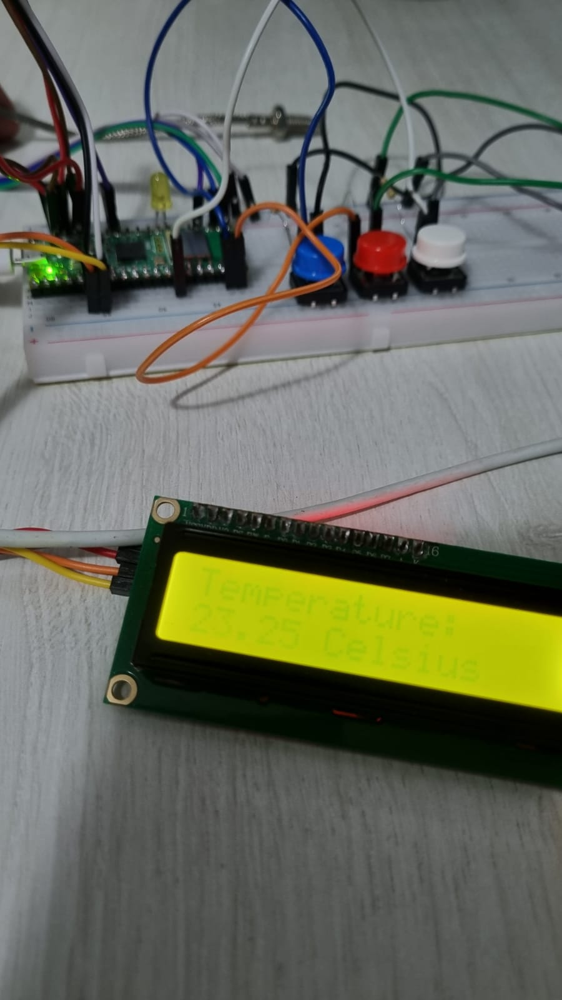

# Termo alarm
Este projeto consiste em apresentar a avaliação de projeto final da disciplina de
Sistemas Embarcados: Arquitetura e Aplicações - UNISAL 10/2023.

# Conteudo
[[_TOC_]]

# O projeto
Este projeto visa ser uma demonstração de um sistema de alarme para um determinado valor X de temperatura.

## Fluxograma
1. Leitura EEPROM sobre a dados salvos.
2. Usuario navega pelos botões para selecionar a temperatura de trigger de alarme
3. Após o enter, o monitoramento começa;
    1. Caso seja detectado uma temperatura maior ou igual ao selecionado, será indicado o alarme.
    2. Em casos normais a temperatura irá se atualizar na tela.

## Pinagens
* *Botão Up* - GPIO **14**
* *Botão Down* - GPIO **15**
* *Botão Enter* - GPIO **10**
* *Led de status alarme* - GPIO **21**
* *LCD* - GPIO **4 e 5** -  I2C default
* *EEPROM* - GPIO **4 e 5** -  I2C default
* *TERMOPAR* - GPIO **16, 17 e 18** -  SPI default
 * Utilizado o sensor **MAX6675**, se desejar alterar para o MAX31856, edite o arquivo (file://./termopar.h):
```c
// Select the temperature sensor
//#define MAX6675
#define MAX31856
```

## Possiveis problemas
Durante o andamento do projeto, apresentou-se alguns problemas com a memória EEPROM, e portanto não foi possivel valiadar 100% a logica do salvamento, apesar da reprodução do que foi apresentado em video aula.


# Autor
Rafael Martins de Sousa
RA 220023201

## Protoboard
